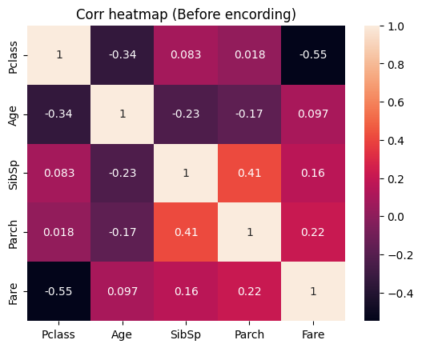
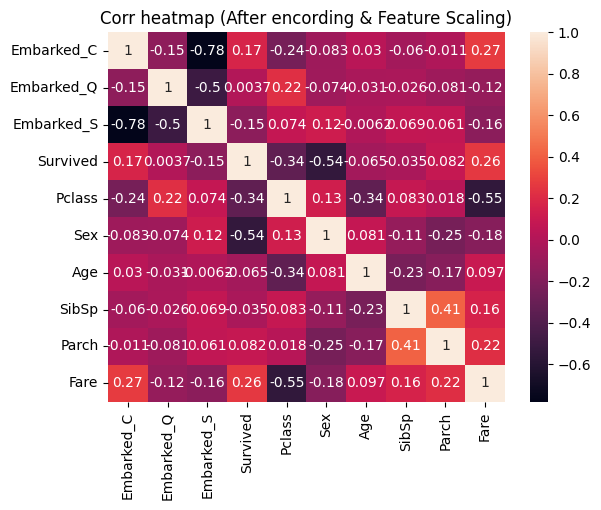

# 使用資料探勘技術分析鐵達尼的乘客資料, 並取得影響乘客最後命運的前三大關鍵因素

## 流程思考：

1. 先對 titanic.csv 檔案進行初步的資料檢閱
2. 了解各Column 的意義
3. 補缺失值
4. Encoding categorical data
5. 特徵縮放 (Feature Scaling) 亦可直接看關聯
6. 關聯性觀察（視覺化）

### 載入資料，並觀察


```python
# Importing the libraries
import numpy as np
import matplotlib.pyplot as plt
import pandas as pd

```


```python
# Importing the dataset
dataset = pd.read_csv('Datasets/titanic.csv')

```

先檢視前五筆資料的樣貌


```python
dataset.head()
```


<div>
<style scoped>
    .dataframe tbody tr th:only-of-type {
        vertical-align: middle;
    }

    .dataframe tbody tr th {
        vertical-align: top;
    }

    .dataframe thead th {
        text-align: right;
    }
</style>
<table border="1" class="dataframe">
  <thead>
    <tr style="text-align: right;">
      <th></th>
      <th>PassengerId</th>
      <th>Survived</th>
      <th>Pclass</th>
      <th>Name</th>
      <th>Sex</th>
      <th>Age</th>
      <th>SibSp</th>
      <th>Parch</th>
      <th>Ticket</th>
      <th>Fare</th>
      <th>Cabin</th>
      <th>Embarked</th>
    </tr>
  </thead>
  <tbody>
    <tr>
      <th>0</th>
      <td>1</td>
      <td>0</td>
      <td>3</td>
      <td>Braund, Mr. Owen Harris</td>
      <td>male</td>
      <td>22.0</td>
      <td>1</td>
      <td>0</td>
      <td>A/5 21171</td>
      <td>7.2500</td>
      <td>NaN</td>
      <td>S</td>
    </tr>
    <tr>
      <th>1</th>
      <td>2</td>
      <td>1</td>
      <td>1</td>
      <td>Cumings, Mrs. John Bradley (Florence Briggs Th...</td>
      <td>female</td>
      <td>38.0</td>
      <td>1</td>
      <td>0</td>
      <td>PC 17599</td>
      <td>71.2833</td>
      <td>C85</td>
      <td>C</td>
    </tr>
    <tr>
      <th>2</th>
      <td>3</td>
      <td>1</td>
      <td>3</td>
      <td>Heikkinen, Miss. Laina</td>
      <td>female</td>
      <td>26.0</td>
      <td>0</td>
      <td>0</td>
      <td>STON/O2. 3101282</td>
      <td>7.9250</td>
      <td>NaN</td>
      <td>S</td>
    </tr>
    <tr>
      <th>3</th>
      <td>4</td>
      <td>1</td>
      <td>1</td>
      <td>Futrelle, Mrs. Jacques Heath (Lily May Peel)</td>
      <td>female</td>
      <td>35.0</td>
      <td>1</td>
      <td>0</td>
      <td>113803</td>
      <td>53.1000</td>
      <td>C123</td>
      <td>S</td>
    </tr>
    <tr>
      <th>4</th>
      <td>5</td>
      <td>0</td>
      <td>3</td>
      <td>Allen, Mr. William Henry</td>
      <td>male</td>
      <td>35.0</td>
      <td>0</td>
      <td>0</td>
      <td>373450</td>
      <td>8.0500</td>
      <td>NaN</td>
      <td>S</td>
    </tr>
  </tbody>
</table>
</div>


可到 Kaggle 網站查詢各個Column 的意義 https://www.kaggle.com/competitions/titanic/data 

| **欄位名稱** |            **定義**           |
|:------------:|:-----------------------------:|
|   Survived   |              存歿             |
|    Pclass    |            購票分級           |
|     Name     |              姓名             |
|      Sex     |              性別             |
|      Age     |              年紀             |
|     SibSp    | 鐵達尼號上的兄弟姊妹/配偶數量 |
|     Parch    |   鐵達尼號上的雙親/子女數量   |
|    Ticket    |            票根號碼           |
|     Fare     |              票價             |
|     Cabin    |            船艙編號           |
|   Embarked   |            登船港口           |

以Pandas 中 Dataframe.info()函式可以顯示資料表內所有欄位的資訊。包含:欄位名稱、非虛值的數目、欄位的資料類型等等。


```python
dataset.info()
```

    <class 'pandas.core.frame.DataFrame'>
    RangeIndex: 891 entries, 0 to 890
    Data columns (total 12 columns):
     #   Column       Non-Null Count  Dtype  
    ---  ------       --------------  -----  
     0   PassengerId  891 non-null    int64  
     1   Survived     891 non-null    int64  
     2   Pclass       891 non-null    int64  
     3   Name         891 non-null    object 
     4   Sex          891 non-null    object 
     5   Age          714 non-null    float64
     6   SibSp        891 non-null    int64  
     7   Parch        891 non-null    int64  
     8   Ticket       891 non-null    object 
     9   Fare         891 non-null    float64
     10  Cabin        204 non-null    object 
     11  Embarked     889 non-null    object 
    dtypes: float64(2), int64(5), object(5)
    memory usage: 83.7+ KB
    

原始表格資料的 Dtype 並非分析時所要的，需要轉換。 <br>
web搜尋方法，將每個欄位修正成相對正確的類型：


```python
dataset.PassengerId = dataset.PassengerId.astype('category')
dataset.Survived = dataset.Survived.astype('category')
dataset.Pclass = dataset.Pclass.astype(int)
dataset.Name = dataset.Name.astype('category')
dataset.Sex = dataset.Sex.astype('category')
dataset.Age = dataset.Age.astype(float)
dataset.SibSp = dataset.SibSp.astype(int)
dataset.Parch = dataset.Parch.astype(int)
dataset.Fare = dataset.Fare.astype(float)
dataset.Cabin = dataset.Cabin.astype('category')
dataset.Embarked = dataset.Embarked.astype('category')
```


```python
dataset.info()
```

    <class 'pandas.core.frame.DataFrame'>
    RangeIndex: 891 entries, 0 to 890
    Data columns (total 12 columns):
     #   Column       Non-Null Count  Dtype   
    ---  ------       --------------  -----   
     0   PassengerId  891 non-null    category
     1   Survived     891 non-null    category
     2   Pclass       891 non-null    int32   
     3   Name         891 non-null    category
     4   Sex          891 non-null    category
     5   Age          714 non-null    float64 
     6   SibSp        891 non-null    int32   
     7   Parch        891 non-null    int32   
     8   Ticket       891 non-null    object  
     9   Fare         891 non-null    float64 
     10  Cabin        204 non-null    category
     11  Embarked     889 non-null    category
    dtypes: category(6), float64(2), int32(3), object(1)
    memory usage: 123.4+ KB
    


```python
# 對所有欄位執行 describe 
dataset.describe(include='all')
```


<div>
<style scoped>
    .dataframe tbody tr th:only-of-type {
        vertical-align: middle;
    }

    .dataframe tbody tr th {
        vertical-align: top;
    }

    .dataframe thead th {
        text-align: right;
    }
</style>
<table border="1" class="dataframe">
  <thead>
    <tr style="text-align: right;">
      <th></th>
      <th>PassengerId</th>
      <th>Survived</th>
      <th>Pclass</th>
      <th>Name</th>
      <th>Sex</th>
      <th>Age</th>
      <th>SibSp</th>
      <th>Parch</th>
      <th>Ticket</th>
      <th>Fare</th>
      <th>Cabin</th>
      <th>Embarked</th>
    </tr>
  </thead>
  <tbody>
    <tr>
      <th>count</th>
      <td>891.0</td>
      <td>891.0</td>
      <td>891.000000</td>
      <td>891</td>
      <td>891</td>
      <td>714.000000</td>
      <td>891.000000</td>
      <td>891.000000</td>
      <td>891</td>
      <td>891.000000</td>
      <td>204</td>
      <td>889</td>
    </tr>
    <tr>
      <th>unique</th>
      <td>891.0</td>
      <td>2.0</td>
      <td>NaN</td>
      <td>891</td>
      <td>2</td>
      <td>NaN</td>
      <td>NaN</td>
      <td>NaN</td>
      <td>681</td>
      <td>NaN</td>
      <td>147</td>
      <td>3</td>
    </tr>
    <tr>
      <th>top</th>
      <td>1.0</td>
      <td>0.0</td>
      <td>NaN</td>
      <td>Abbing, Mr. Anthony</td>
      <td>male</td>
      <td>NaN</td>
      <td>NaN</td>
      <td>NaN</td>
      <td>347082</td>
      <td>NaN</td>
      <td>C23 C25 C27</td>
      <td>S</td>
    </tr>
    <tr>
      <th>freq</th>
      <td>1.0</td>
      <td>549.0</td>
      <td>NaN</td>
      <td>1</td>
      <td>577</td>
      <td>NaN</td>
      <td>NaN</td>
      <td>NaN</td>
      <td>7</td>
      <td>NaN</td>
      <td>4</td>
      <td>644</td>
    </tr>
    <tr>
      <th>mean</th>
      <td>NaN</td>
      <td>NaN</td>
      <td>2.308642</td>
      <td>NaN</td>
      <td>NaN</td>
      <td>29.699118</td>
      <td>0.523008</td>
      <td>0.381594</td>
      <td>NaN</td>
      <td>32.204208</td>
      <td>NaN</td>
      <td>NaN</td>
    </tr>
    <tr>
      <th>std</th>
      <td>NaN</td>
      <td>NaN</td>
      <td>0.836071</td>
      <td>NaN</td>
      <td>NaN</td>
      <td>14.526497</td>
      <td>1.102743</td>
      <td>0.806057</td>
      <td>NaN</td>
      <td>49.693429</td>
      <td>NaN</td>
      <td>NaN</td>
    </tr>
    <tr>
      <th>min</th>
      <td>NaN</td>
      <td>NaN</td>
      <td>1.000000</td>
      <td>NaN</td>
      <td>NaN</td>
      <td>0.420000</td>
      <td>0.000000</td>
      <td>0.000000</td>
      <td>NaN</td>
      <td>0.000000</td>
      <td>NaN</td>
      <td>NaN</td>
    </tr>
    <tr>
      <th>25%</th>
      <td>NaN</td>
      <td>NaN</td>
      <td>2.000000</td>
      <td>NaN</td>
      <td>NaN</td>
      <td>20.125000</td>
      <td>0.000000</td>
      <td>0.000000</td>
      <td>NaN</td>
      <td>7.910400</td>
      <td>NaN</td>
      <td>NaN</td>
    </tr>
    <tr>
      <th>50%</th>
      <td>NaN</td>
      <td>NaN</td>
      <td>3.000000</td>
      <td>NaN</td>
      <td>NaN</td>
      <td>28.000000</td>
      <td>0.000000</td>
      <td>0.000000</td>
      <td>NaN</td>
      <td>14.454200</td>
      <td>NaN</td>
      <td>NaN</td>
    </tr>
    <tr>
      <th>75%</th>
      <td>NaN</td>
      <td>NaN</td>
      <td>3.000000</td>
      <td>NaN</td>
      <td>NaN</td>
      <td>38.000000</td>
      <td>1.000000</td>
      <td>0.000000</td>
      <td>NaN</td>
      <td>31.000000</td>
      <td>NaN</td>
      <td>NaN</td>
    </tr>
    <tr>
      <th>max</th>
      <td>NaN</td>
      <td>NaN</td>
      <td>3.000000</td>
      <td>NaN</td>
      <td>NaN</td>
      <td>80.000000</td>
      <td>8.000000</td>
      <td>6.000000</td>
      <td>NaN</td>
      <td>512.329200</td>
      <td>NaN</td>
      <td>NaN</td>
    </tr>
  </tbody>
</table>
</div>


### 補缺失值

觀察到 Age、Cabin、Embarked 皆有缺值，由於缺值會影響分析，但特徵資料對於資料的意義也很重要，個人認為盡量不要直接 drop 掉整個column，盡量蒐集資料補缺值。這部分可以參考 Kaggle 參賽者的分享資訊，Age 的補缺值方式並非隨意補值，其牽涉到背景邏輯的合理因素。<br>
例如：Age 可能和 家長是否有帶家人小孩一起登船（與SibSp、Parch 有關），而家庭登船大多會選在同一個登船港口、船艙，所以補值時可以參照。


由於補值參照資料牽涉其他複雜的分析，本擬簡化步驟直接先對缺失資料值最多的 Cabin 捨去不用。 對 Age 欄位以中位數補值，對 Embarked 欄位以眾數資料補值。
而PassengerId、Name、Ticket也捨去不用


```python
#查看 Embarked 資料中出現最高頻率的值
print(dataset.Embarked.value_counts())

```

    S    644
    C    168
    Q     77
    Name: Embarked, dtype: int64
    


```python
dataset["Age"] = dataset["Age"].fillna(dataset["Age"].median())  # 對 Age 欄位以中位數補值
dataset["Embarked"] = dataset["Embarked"].fillna("S")  # 全部缺值用出現頻率最高的 「S」填入
dataset = dataset.drop(["PassengerId", "Name", "Ticket", "Cabin"], axis = 1)

dataset.info()
```

    <class 'pandas.core.frame.DataFrame'>
    RangeIndex: 891 entries, 0 to 890
    Data columns (total 8 columns):
     #   Column    Non-Null Count  Dtype   
    ---  ------    --------------  -----   
     0   Survived  891 non-null    category
     1   Pclass    891 non-null    int32   
     2   Sex       891 non-null    category
     3   Age       891 non-null    float64 
     4   SibSp     891 non-null    int32   
     5   Parch     891 non-null    int32   
     6   Fare      891 non-null    float64 
     7   Embarked  891 non-null    category
    dtypes: category(3), float64(2), int32(3)
    memory usage: 27.5 KB
    


```python
# 查看更新後的dataset 的 describe
dataset.describe(include='all')
```


<div>
<style scoped>
    .dataframe tbody tr th:only-of-type {
        vertical-align: middle;
    }

    .dataframe tbody tr th {
        vertical-align: top;
    }

    .dataframe thead th {
        text-align: right;
    }
</style>
<table border="1" class="dataframe">
  <thead>
    <tr style="text-align: right;">
      <th></th>
      <th>Survived</th>
      <th>Pclass</th>
      <th>Sex</th>
      <th>Age</th>
      <th>SibSp</th>
      <th>Parch</th>
      <th>Fare</th>
      <th>Embarked</th>
    </tr>
  </thead>
  <tbody>
    <tr>
      <th>count</th>
      <td>891.0</td>
      <td>891.000000</td>
      <td>891</td>
      <td>891.000000</td>
      <td>891.000000</td>
      <td>891.000000</td>
      <td>891.000000</td>
      <td>891</td>
    </tr>
    <tr>
      <th>unique</th>
      <td>2.0</td>
      <td>NaN</td>
      <td>2</td>
      <td>NaN</td>
      <td>NaN</td>
      <td>NaN</td>
      <td>NaN</td>
      <td>3</td>
    </tr>
    <tr>
      <th>top</th>
      <td>0.0</td>
      <td>NaN</td>
      <td>male</td>
      <td>NaN</td>
      <td>NaN</td>
      <td>NaN</td>
      <td>NaN</td>
      <td>S</td>
    </tr>
    <tr>
      <th>freq</th>
      <td>549.0</td>
      <td>NaN</td>
      <td>577</td>
      <td>NaN</td>
      <td>NaN</td>
      <td>NaN</td>
      <td>NaN</td>
      <td>646</td>
    </tr>
    <tr>
      <th>mean</th>
      <td>NaN</td>
      <td>2.308642</td>
      <td>NaN</td>
      <td>29.361582</td>
      <td>0.523008</td>
      <td>0.381594</td>
      <td>32.204208</td>
      <td>NaN</td>
    </tr>
    <tr>
      <th>std</th>
      <td>NaN</td>
      <td>0.836071</td>
      <td>NaN</td>
      <td>13.019697</td>
      <td>1.102743</td>
      <td>0.806057</td>
      <td>49.693429</td>
      <td>NaN</td>
    </tr>
    <tr>
      <th>min</th>
      <td>NaN</td>
      <td>1.000000</td>
      <td>NaN</td>
      <td>0.420000</td>
      <td>0.000000</td>
      <td>0.000000</td>
      <td>0.000000</td>
      <td>NaN</td>
    </tr>
    <tr>
      <th>25%</th>
      <td>NaN</td>
      <td>2.000000</td>
      <td>NaN</td>
      <td>22.000000</td>
      <td>0.000000</td>
      <td>0.000000</td>
      <td>7.910400</td>
      <td>NaN</td>
    </tr>
    <tr>
      <th>50%</th>
      <td>NaN</td>
      <td>3.000000</td>
      <td>NaN</td>
      <td>28.000000</td>
      <td>0.000000</td>
      <td>0.000000</td>
      <td>14.454200</td>
      <td>NaN</td>
    </tr>
    <tr>
      <th>75%</th>
      <td>NaN</td>
      <td>3.000000</td>
      <td>NaN</td>
      <td>35.000000</td>
      <td>1.000000</td>
      <td>0.000000</td>
      <td>31.000000</td>
      <td>NaN</td>
    </tr>
    <tr>
      <th>max</th>
      <td>NaN</td>
      <td>3.000000</td>
      <td>NaN</td>
      <td>80.000000</td>
      <td>8.000000</td>
      <td>6.000000</td>
      <td>512.329200</td>
      <td>NaN</td>
    </tr>
  </tbody>
</table>
</div>


```python
# 查看補值、刪除欄位後的表格
dataset
```


<div>
<style scoped>
    .dataframe tbody tr th:only-of-type {
        vertical-align: middle;
    }

    .dataframe tbody tr th {
        vertical-align: top;
    }

    .dataframe thead th {
        text-align: right;
    }
</style>
<table border="1" class="dataframe">
  <thead>
    <tr style="text-align: right;">
      <th></th>
      <th>Survived</th>
      <th>Pclass</th>
      <th>Sex</th>
      <th>Age</th>
      <th>SibSp</th>
      <th>Parch</th>
      <th>Fare</th>
      <th>Embarked</th>
    </tr>
  </thead>
  <tbody>
    <tr>
      <th>0</th>
      <td>0</td>
      <td>3</td>
      <td>male</td>
      <td>22.0</td>
      <td>1</td>
      <td>0</td>
      <td>7.2500</td>
      <td>S</td>
    </tr>
    <tr>
      <th>1</th>
      <td>1</td>
      <td>1</td>
      <td>female</td>
      <td>38.0</td>
      <td>1</td>
      <td>0</td>
      <td>71.2833</td>
      <td>C</td>
    </tr>
    <tr>
      <th>2</th>
      <td>1</td>
      <td>3</td>
      <td>female</td>
      <td>26.0</td>
      <td>0</td>
      <td>0</td>
      <td>7.9250</td>
      <td>S</td>
    </tr>
    <tr>
      <th>3</th>
      <td>1</td>
      <td>1</td>
      <td>female</td>
      <td>35.0</td>
      <td>1</td>
      <td>0</td>
      <td>53.1000</td>
      <td>S</td>
    </tr>
    <tr>
      <th>4</th>
      <td>0</td>
      <td>3</td>
      <td>male</td>
      <td>35.0</td>
      <td>0</td>
      <td>0</td>
      <td>8.0500</td>
      <td>S</td>
    </tr>
    <tr>
      <th>...</th>
      <td>...</td>
      <td>...</td>
      <td>...</td>
      <td>...</td>
      <td>...</td>
      <td>...</td>
      <td>...</td>
      <td>...</td>
    </tr>
    <tr>
      <th>886</th>
      <td>0</td>
      <td>2</td>
      <td>male</td>
      <td>27.0</td>
      <td>0</td>
      <td>0</td>
      <td>13.0000</td>
      <td>S</td>
    </tr>
    <tr>
      <th>887</th>
      <td>1</td>
      <td>1</td>
      <td>female</td>
      <td>19.0</td>
      <td>0</td>
      <td>0</td>
      <td>30.0000</td>
      <td>S</td>
    </tr>
    <tr>
      <th>888</th>
      <td>0</td>
      <td>3</td>
      <td>female</td>
      <td>28.0</td>
      <td>1</td>
      <td>2</td>
      <td>23.4500</td>
      <td>S</td>
    </tr>
    <tr>
      <th>889</th>
      <td>1</td>
      <td>1</td>
      <td>male</td>
      <td>26.0</td>
      <td>0</td>
      <td>0</td>
      <td>30.0000</td>
      <td>C</td>
    </tr>
    <tr>
      <th>890</th>
      <td>0</td>
      <td>3</td>
      <td>male</td>
      <td>32.0</td>
      <td>0</td>
      <td>0</td>
      <td>7.7500</td>
      <td>Q</td>
    </tr>
  </tbody>
</table>
<p>891 rows × 8 columns</p>
</div>


在還沒做 類別變量轉換之前，先以 Seaborn 的熱度圖觀察表徵之間的線性關聯。


```python
#使用seaborn的熱度圖觀察表徵之間的線性關聯
import seaborn as sns
plt.figure()
feature_corr = dataset.corr()
sns.heatmap(feature_corr, annot=True)
plt.title("Corr heatmap (Before encording)")
plt.show()
```

      feature_corr = dataset.corr()
    


    

    


```python
dataset.loc[:, "Survived"]
```


    0      0
    1      1
    2      1
    3      1
    4      0
          ..
    886    0
    887    1
    888    0
    889    1
    890    0
    Name: Survived, Length: 891, dtype: category
    Categories (2, int64): [0, 1]


### Encoding categorical data (文字轉數字)


```python
# Encoding categorical data
# Encoding the Independent Variable
from sklearn.preprocessing import LabelEncoder, OneHotEncoder
from sklearn.compose import ColumnTransformer

labelencoder = LabelEncoder()
dataset.loc[:, "Survived"] = labelencoder.fit_transform(dataset.loc[:, "Survived"])
dataset.loc[:, "Sex"] = labelencoder.fit_transform(dataset.loc[:, "Sex"])

## 寫法草稿一
# onehotencoder = OneHotEncoder()
# dataset = onehotencoder.fit_transform(dataset["Embarked"].array.reshape(1, -1)).toarray()

# 寫法草稿二（類似範例）
onehotencoder = ColumnTransformer(transformers=[("Embarked", OneHotEncoder(), ["Embarked"])], remainder = 'passthrough')
onehot_Embarked = onehotencoder.fit_transform(dataset)   # onehot_Embarked 為 array型態
dataset_encoding = pd.DataFrame(onehot_Embarked, columns = [
    'Embarked_C','Embarked_Q', 'Embarked_S', 'Survived', 'Pclass', 'Sex', 'Age', 'SibSp', 'Parch', 'Fare'], dtype=int) 

```

    C:\Users\Tibame_T14\AppData\Local\Temp\ipykernel_13376\536368733.py:7: FutureWarning: In a future version, `df.iloc[:, i] = newvals` will attempt to set the values inplace instead of always setting a new array. To retain the old behavior, use either `df[df.columns[i]] = newvals` or, if columns are non-unique, `df.isetitem(i, newvals)`
      dataset.loc[:, "Survived"] = labelencoder.fit_transform(dataset.loc[:, "Survived"])
    C:\Users\Tibame_T14\AppData\Local\Temp\ipykernel_13376\536368733.py:8: FutureWarning: In a future version, `df.iloc[:, i] = newvals` will attempt to set the values inplace instead of always setting a new array. To retain the old behavior, use either `df[df.columns[i]] = newvals` or, if columns are non-unique, `df.isetitem(i, newvals)`
      dataset.loc[:, "Sex"] = labelencoder.fit_transform(dataset.loc[:, "Sex"])
    C:\Users\Tibame_T14\AppData\Local\Temp\ipykernel_13376\536368733.py:17: FutureWarning: In a future version, passing float-dtype values and an integer dtype to DataFrame will retain floating dtype if they cannot be cast losslessly (matching Series behavior). To retain the old behavior, use DataFrame(data).astype(dtype)
      dataset_encoding = pd.DataFrame(onehot_Embarked, columns = [
    


```python
dataset_encoding
```


<div>
<style scoped>
    .dataframe tbody tr th:only-of-type {
        vertical-align: middle;
    }

    .dataframe tbody tr th {
        vertical-align: top;
    }

    .dataframe thead th {
        text-align: right;
    }
</style>
<table border="1" class="dataframe">
  <thead>
    <tr style="text-align: right;">
      <th></th>
      <th>Embarked_C</th>
      <th>Embarked_Q</th>
      <th>Embarked_S</th>
      <th>Survived</th>
      <th>Pclass</th>
      <th>Sex</th>
      <th>Age</th>
      <th>SibSp</th>
      <th>Parch</th>
      <th>Fare</th>
    </tr>
  </thead>
  <tbody>
    <tr>
      <th>0</th>
      <td>0</td>
      <td>0</td>
      <td>1</td>
      <td>0</td>
      <td>3</td>
      <td>1</td>
      <td>22</td>
      <td>1</td>
      <td>0</td>
      <td>7</td>
    </tr>
    <tr>
      <th>1</th>
      <td>1</td>
      <td>0</td>
      <td>0</td>
      <td>1</td>
      <td>1</td>
      <td>0</td>
      <td>38</td>
      <td>1</td>
      <td>0</td>
      <td>71</td>
    </tr>
    <tr>
      <th>2</th>
      <td>0</td>
      <td>0</td>
      <td>1</td>
      <td>1</td>
      <td>3</td>
      <td>0</td>
      <td>26</td>
      <td>0</td>
      <td>0</td>
      <td>7</td>
    </tr>
    <tr>
      <th>3</th>
      <td>0</td>
      <td>0</td>
      <td>1</td>
      <td>1</td>
      <td>1</td>
      <td>0</td>
      <td>35</td>
      <td>1</td>
      <td>0</td>
      <td>53</td>
    </tr>
    <tr>
      <th>4</th>
      <td>0</td>
      <td>0</td>
      <td>1</td>
      <td>0</td>
      <td>3</td>
      <td>1</td>
      <td>35</td>
      <td>0</td>
      <td>0</td>
      <td>8</td>
    </tr>
    <tr>
      <th>...</th>
      <td>...</td>
      <td>...</td>
      <td>...</td>
      <td>...</td>
      <td>...</td>
      <td>...</td>
      <td>...</td>
      <td>...</td>
      <td>...</td>
      <td>...</td>
    </tr>
    <tr>
      <th>886</th>
      <td>0</td>
      <td>0</td>
      <td>1</td>
      <td>0</td>
      <td>2</td>
      <td>1</td>
      <td>27</td>
      <td>0</td>
      <td>0</td>
      <td>13</td>
    </tr>
    <tr>
      <th>887</th>
      <td>0</td>
      <td>0</td>
      <td>1</td>
      <td>1</td>
      <td>1</td>
      <td>0</td>
      <td>19</td>
      <td>0</td>
      <td>0</td>
      <td>30</td>
    </tr>
    <tr>
      <th>888</th>
      <td>0</td>
      <td>0</td>
      <td>1</td>
      <td>0</td>
      <td>3</td>
      <td>0</td>
      <td>28</td>
      <td>1</td>
      <td>2</td>
      <td>23</td>
    </tr>
    <tr>
      <th>889</th>
      <td>1</td>
      <td>0</td>
      <td>0</td>
      <td>1</td>
      <td>1</td>
      <td>1</td>
      <td>26</td>
      <td>0</td>
      <td>0</td>
      <td>30</td>
    </tr>
    <tr>
      <th>890</th>
      <td>0</td>
      <td>1</td>
      <td>0</td>
      <td>0</td>
      <td>3</td>
      <td>1</td>
      <td>32</td>
      <td>0</td>
      <td>0</td>
      <td>7</td>
    </tr>
  </tbody>
</table>
<p>891 rows × 10 columns</p>
</div>


Emarked欄位已經被編碼為三個虛擬變量，分別代表三個港口上船與否的欄位。


```python
# 使用seaborn的熱度圖觀察表徵之間的線性關聯

plt.figure()
feature_corr_encoding = dataset_encoding.corr()
sns.heatmap(feature_corr_encoding, annot=True)
plt.title("Corr heatmap (After encording)")
plt.show()
```


    

    


### Feature Scaling


```python
# Feature Scaling
from sklearn.preprocessing import MinMaxScaler
minmaxscaler = MinMaxScaler() 
sc_data = minmaxscaler.fit_transform(dataset_encoding.iloc[:, :])

# 將 sc_data 轉成 dataframe
dataset_encoding_sc = pd.DataFrame(sc_data, columns = [
    'Embarked_C','Embarked_Q', 'Embarked_S', 'Survived', 'Pclass', 'Sex', 'Age', 'SibSp', 'Parch', 'Fare'], dtype=float) 

```


```python
dataset_encoding_sc
```


<div>
<style scoped>
    .dataframe tbody tr th:only-of-type {
        vertical-align: middle;
    }

    .dataframe tbody tr th {
        vertical-align: top;
    }

    .dataframe thead th {
        text-align: right;
    }
</style>
<table border="1" class="dataframe">
  <thead>
    <tr style="text-align: right;">
      <th></th>
      <th>Embarked_C</th>
      <th>Embarked_Q</th>
      <th>Embarked_S</th>
      <th>Survived</th>
      <th>Pclass</th>
      <th>Sex</th>
      <th>Age</th>
      <th>SibSp</th>
      <th>Parch</th>
      <th>Fare</th>
    </tr>
  </thead>
  <tbody>
    <tr>
      <th>0</th>
      <td>0.0</td>
      <td>0.0</td>
      <td>1.0</td>
      <td>0.0</td>
      <td>1.0</td>
      <td>1.0</td>
      <td>0.2750</td>
      <td>0.125</td>
      <td>0.000000</td>
      <td>0.013672</td>
    </tr>
    <tr>
      <th>1</th>
      <td>1.0</td>
      <td>0.0</td>
      <td>0.0</td>
      <td>1.0</td>
      <td>0.0</td>
      <td>0.0</td>
      <td>0.4750</td>
      <td>0.125</td>
      <td>0.000000</td>
      <td>0.138672</td>
    </tr>
    <tr>
      <th>2</th>
      <td>0.0</td>
      <td>0.0</td>
      <td>1.0</td>
      <td>1.0</td>
      <td>1.0</td>
      <td>0.0</td>
      <td>0.3250</td>
      <td>0.000</td>
      <td>0.000000</td>
      <td>0.013672</td>
    </tr>
    <tr>
      <th>3</th>
      <td>0.0</td>
      <td>0.0</td>
      <td>1.0</td>
      <td>1.0</td>
      <td>0.0</td>
      <td>0.0</td>
      <td>0.4375</td>
      <td>0.125</td>
      <td>0.000000</td>
      <td>0.103516</td>
    </tr>
    <tr>
      <th>4</th>
      <td>0.0</td>
      <td>0.0</td>
      <td>1.0</td>
      <td>0.0</td>
      <td>1.0</td>
      <td>1.0</td>
      <td>0.4375</td>
      <td>0.000</td>
      <td>0.000000</td>
      <td>0.015625</td>
    </tr>
    <tr>
      <th>...</th>
      <td>...</td>
      <td>...</td>
      <td>...</td>
      <td>...</td>
      <td>...</td>
      <td>...</td>
      <td>...</td>
      <td>...</td>
      <td>...</td>
      <td>...</td>
    </tr>
    <tr>
      <th>886</th>
      <td>0.0</td>
      <td>0.0</td>
      <td>1.0</td>
      <td>0.0</td>
      <td>0.5</td>
      <td>1.0</td>
      <td>0.3375</td>
      <td>0.000</td>
      <td>0.000000</td>
      <td>0.025391</td>
    </tr>
    <tr>
      <th>887</th>
      <td>0.0</td>
      <td>0.0</td>
      <td>1.0</td>
      <td>1.0</td>
      <td>0.0</td>
      <td>0.0</td>
      <td>0.2375</td>
      <td>0.000</td>
      <td>0.000000</td>
      <td>0.058594</td>
    </tr>
    <tr>
      <th>888</th>
      <td>0.0</td>
      <td>0.0</td>
      <td>1.0</td>
      <td>0.0</td>
      <td>1.0</td>
      <td>0.0</td>
      <td>0.3500</td>
      <td>0.125</td>
      <td>0.333333</td>
      <td>0.044922</td>
    </tr>
    <tr>
      <th>889</th>
      <td>1.0</td>
      <td>0.0</td>
      <td>0.0</td>
      <td>1.0</td>
      <td>0.0</td>
      <td>1.0</td>
      <td>0.3250</td>
      <td>0.000</td>
      <td>0.000000</td>
      <td>0.058594</td>
    </tr>
    <tr>
      <th>890</th>
      <td>0.0</td>
      <td>1.0</td>
      <td>0.0</td>
      <td>0.0</td>
      <td>1.0</td>
      <td>1.0</td>
      <td>0.4000</td>
      <td>0.000</td>
      <td>0.000000</td>
      <td>0.013672</td>
    </tr>
  </tbody>
</table>
<p>891 rows × 10 columns</p>
</div>


```python
# 使用seaborn的熱度圖觀察表徵之間的線性關聯

plt.figure()
feature_corr_encoding_sc = dataset_encoding_sc.corr()
sns.heatmap(feature_corr_encoding_sc, annot=True)
plt.title("Corr heatmap (After encording & Feature Scaling)")
plt.show()
```


    

    


由 seaborn的熱度圖觀察表徵之間的線性關聯，可以發現影響生還的前三大關鍵因素：
1. Sex (性別)，為負相關，{男: 1, 女: 0}， corr=-0.54
2. Pclass（購票等級），corr=-0.34，票等1 愈容易生還，票等3愈不易生還
3. Fare（票價），corr=0.26 ，表示票價愈貴愈容易生還
